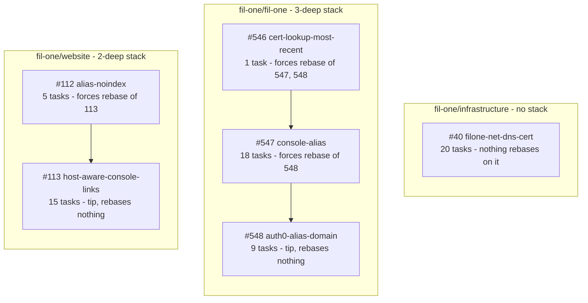
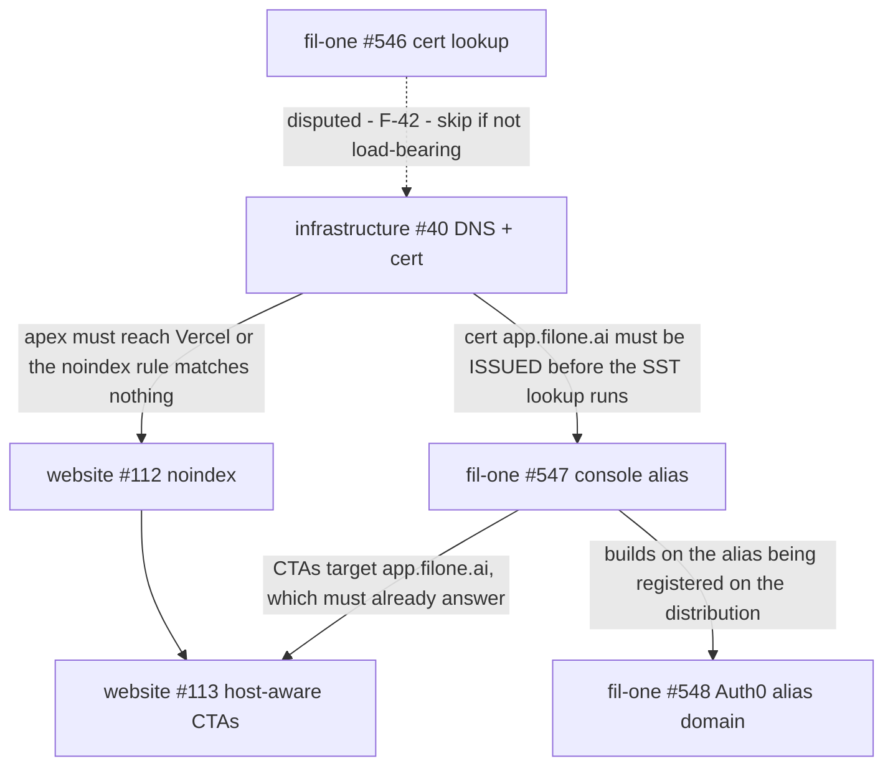

# PR stack implementation plan — FIL-897 — 2026-08-10

> **Executed 2026-08-11.** Nearly every task below is applied; three findings were
> corrected in the process and one blocker survives. See §10 of the review document
> for what changed and what is still open. Do not re-run these tasks blind.

Companion to `PR-STACK-REVIEW-FIL-897-2026-08-10.md`. Finding IDs match.

Every fix lands in the branch of the PR that introduced it, so pushing updates the
existing PR. **No new PRs anywhere in this plan.**

## Rebase blast radius


*Caption: rebase cost is confined within each subgraph — touching `fil-one/website` costs nothing in the other two repos. Only `#546` and `#112` carry a rebase penalty, and `#546`'s single task may turn out to be unnecessary (F-42).*

**Cost per group.** `infrastructure#40` is standalone: 20 tasks, zero rebase cost.
`fil-one#548` and `website#113` are tips: 24 tasks between them, zero rebase cost — do
these first. `fil-one#547` costs one rebase (`#548`). `website#112` costs one rebase
(`#113`). `fil-one#546` costs two rebases and its one task is blocked on F-42, so leave it
last or skip it.

## Blockers — resolve before any code task

These three are questions, not edits. Two of them change what the tasks should be.

**B-1 (F-01) — read the speculative Terraform plan on `infrastructure#40`.**
Determines whether `cloudflare_record.app_acm_validation` is an in-place update or a
destroy/create of the validation record protecting the certificate CloudFront is currently
serving. Also decides task T-19.
```
gh pr view 40 --repo fil-one/infrastructure --json statusCheckRollup \
  --jq '.statusCheckRollup[] | select(.context // "" | test("Terraform")) | .targetUrl'
```
Open that URL. Requires the HCP Terraform `Viewer` role.

**B-2 (F-42) — establish whether `aws.acm.getCertificate({domain})` matches SANs.**
Decides whether `#546` is load-bearing and whether the `#546 → #40` ordering constraint
exists at all. Cheapest empirical check, run against the current prod account:
```
aws acm list-certificates --region us-east-1 \
  --query 'CertificateSummaryList[?contains(SubjectAlternativeNameSummaries, `app.fil.one`)].[CertificateArn,DomainName]'
```
If exactly one cert has `app.fil.one` as `DomainName` but others carry it as a SAN, then
look one up with `domain: 'app.fil.one'` in a scratch Pulumi invoke and see whether it
errors on multiple matches.

**B-3 (F-50) — confirm Vercel `headers` are cumulative, not first-match.**
If first-match, `#112` is a no-op and the `noindex` rule must move to index 0. Run against
a preview deployment with the alias attached:
```
curl -sI https://<preview>/        -H 'Host: filone.ai'   | grep -i x-robots-tag   # must be present
curl -sI https://<preview>/pricing -H 'Host: www.filone.ai' | grep -i x-robots-tag # must be present
curl -sI https://<preview>/        -H 'Host: www.fil.one' | grep -i x-robots-tag   # must be ABSENT
curl -sI https://<preview>/pricing -H 'Host: filone.ai'   | grep -i cache-control  # must still be present
```
The fourth is the discriminating one: `Cache-Control` **and** `X-Robots-Tag` on the same
response means cumulative and the placement is fine.

---

## Group 1 — `fil-one/fil-one` #548 (tip, rebase cost: none)

Target branch `srdjan/fil-897-auth0-alias-domain`.

### Mechanical

**T-37 (F-37) — add the missing completeness invariant. Highest value in the repo.**
`packages/shared/src/constants.test.ts`, inside `describe('demo alias constants')`.
Without it, adding an alias host with no `AUTH0_DOMAIN_BY_CONSOLE_ORIGIN` entry routes
its login through `auth.fil.one` — the flagged TLD `#548` exists to escape — silently.
Add the `AUTH0_DOMAIN_BY_CONSOLE_ORIGIN` import, then:
```ts
it('gives every production console origin an Auth0 domain to authenticate against', () => {
  for (const host of [PROD_CONSOLE_HOST, ...PROD_CONSOLE_ALIAS_HOSTS]) {
    expect(AUTH0_DOMAIN_BY_CONSOLE_ORIGIN[`https://${host}`]).toBeDefined();
  }
});
```
Verify: `pnpm --filter @filone/shared test`

**T-21 (F-21)** — `packages/shared/src/constants.ts`, JSDoc above
`AUTH0_DOMAIN_BY_CONSOLE_ORIGIN`. Anchor: `* Consequences worth knowing about, neither of
which is a regression:`. 20 lines on a two-entry table; both bullets are reproduced almost
verbatim in `docs/Auth0OneTimeSetup.md` §4a and again in `auth0-domain.ts`. Reduce to the
one thing a reader of the table cannot infer:
```ts
/**
 * Auth0 domain to authenticate against, keyed by console origin. Aliases cannot use
 * auth.fil.one: a second Auth0 custom domain needs an Enterprise plan, and auth.fil.one
 * is on the flagged TLD the aliases exist to escape. Consequences — passkeys and
 * sessions do not carry across — are in docs/Auth0OneTimeSetup.md §4a.
 */
```
Verify: `pnpm lint && pnpm --filter @filone/shared test`

**T-22 (F-22)** — `packages/backend/src/lib/auth0-domain.ts`, JSDoc above
`resolveAuth0Domain`. Anchor: `* Every use of this value has to agree with the domain that
minted the request's`. 21 lines on a 5-line function, third copy of the same rationale.
Keep only the trust boundary, and fix the false clause per T-46:
```ts
/**
 * Auth0 domain for this request's host. `x-forwarded-host` is set from `Host` by the
 * Router's viewer-request function, but is attacker-controlled on the public execute-api
 * path, so the closed table is the only gate; an unrecognised host falls back to the
 * stage's configured domain. Rationale: AUTH0_DOMAIN_BY_CONSOLE_ORIGIN in @filone/shared.
 */
```
Verify: `pnpm lint`

**T-35 (F-35)** — `packages/backend/src/lib/auth0-domain.test.ts`, lines ~51–60. Anchor:
`['a suffix attack', 'app.fil.one.attacker.example'],`. The table is a strict subset of
`resolve-origin.test.ts`' — 7 rows testing one property seven times. Cut to three rows
(`'attacker.example'`, `'app.fil.one.attacker.example'`, `'https://app.filone.ai'`) and add
the case that covers a real, currently-untested difference between the two functions:
```ts
it('ignores x-dev-origin, which must never select an Auth0 domain', () => {
  expect(resolveAuth0Domain(eventWith({ 'x-dev-origin': 'https://app.filone.ai' }))).toBe(
    CONFIGURED,
  );
});
```
Verify: `pnpm --filter @filone/backend test`

**T-43 (F-43)** — replace "the resolved origin" with "the request host" in
`packages/shared/src/constants.ts` (`AUTH0_DOMAIN_BY_CONSOLE_ORIGIN` doc),
`packages/backend/src/lib/auth0-domain.ts`, and `docs/Auth0OneTimeSetup.md` §4a. The code
keys on the raw header and that is correct; only the prose is wrong.
Verify: `pnpm lint` (prose only, no behaviour)

**T-45 (F-45)** — `docs/Auth0OneTimeSetup.md` §4a. Anchor: `Adding a _new_ alias hostname
means adding it to`. Complete the checklist — it currently omits two of four required
edits, each producing a silently half-working alias:
> Adding a _new_ alias hostname means adding it to `PROD_CONSOLE_ALIAS_HOSTS`, to
> `AUTH0_DOMAIN_BY_CONSOLE_ORIGIN` and to `MARKETING_URL_BY_CONSOLE_ORIGIN` (the
> completeness tests in `packages/shared/src/constants.test.ts` fail if you miss either
> table), to `CONSOLE_ORIGIN_BY_SITE_HOST` in `fil-one/website` `src/lib/console-url.ts`,
> covering it with the CloudFront certificate in `fil-one/infrastructure`, and bumping the
> `Version` property on `SetupStack`.

### Needs judgment

**T-46 (F-46)** — `packages/backend/src/lib/auth0-domain.ts`. Anchor: `* to the same tenant
and share signing keys, so choosing between them grants no`. The stated reason the lookup
is safe is false on every stage except production. Recommended option (a), comment-only:
replace the clause with `an unrecognised host falls back to the stage's configured domain,
and forging a recognised one only selects a domain whose iss and audience then fail
validation — so it can deny a login, never complete one.` Then annotate the table in
`constants.ts`: `// Production hosts only. Non-production stages never match and fall
through to their configured domain.`
Option (b) — gate the lookup on `FILONE_STAGE` — is a **behaviour change** on
non-production stages and needs its own test. Do not do (b) without deciding it explicitly.
Verify: `pnpm --filter @filone/backend test`

**T-41 (F-41)** — `packages/backend/src/middleware/auth.test.ts`, `describe('per-host Auth0
domain')`. Anchor: `// First request for this domain, so its JWKS set is built here`. The
assertion discriminates only because earlier cases in the file pre-populate `jwksByDomain`,
which no hook resets; it stops discriminating under `it.only` or a `-t` filter. Low
confidence, low value. Prefer softening the comment to `// Fetched per domain; relies on
earlier cases in this file having populated the cache for other domains.` over adding test
machinery for a two-line function.

**T-44 (F-44)** — correct `#548`'s PR description: it covers 7 of `resolve-origin`'s 13
hostile rows, not "the same hostile-input set". Description edit only.

---

## Group 2 — `fil-one/website` #113 (tip, rebase cost: none)

Target branch `srdjan/fil-897-host-aware-console-links`.

### Mechanical

**T-59 (F-59)** — `src/lib/console-url.ts`. Convert all 6 string literals to double quotes.
`src/` has 876 double-quoted imports against 30 single-quoted; this file's own test uses
double quotes. `eslint.config.js` sets no `quotes` rule, which is why lint passed.
Verify: `npm run lint && npm run typecheck`

**T-60 (F-60)** — `src/components/CtaSection.test.tsx:32`. Anchor:
`destination: "https://app.fil.one/login?screen_hint=signup",`. `CtaSection.tsx` now calls
`signupUrl()`; the test still asserts the old literal and passes only because jsdom's
hostname is `localhost`. Import the helper and assert `destination: signupUrl()`.
Verify: `npx vitest run src/components/CtaSection.test.tsx`

**T-57 (F-57)** — `src/lib/console-url.test.ts`, lines 29 and 49. Anchor:
`expect(consoleOrigin()).toBe(DEFAULT_CONSOLE_ORIGIN);`. Asserting against the imported
constant is a tautology that cannot catch a wrong value — which is the mistake worth
catching, given X-1. Use the literal `"https://app.fil.one"`, matching lines 59/66 and the
alias side. Then drop `DEFAULT_CONSOLE_ORIGIN` from the import on line 2.
Verify: `npx vitest run src/lib/console-url.test.ts`

**T-56 (F-56)** — `src/lib/console-url.ts`. Drop `export` from `DEFAULT_CONSOLE_ORIGIN`.
Unused outside the module and its test (repo-wide grep of `src/` and `scripts/`). Depends on
T-57.
Verify: `npm run typecheck`

**T-61 (F-61)** — `src/lib/console-url.test.ts:34`. Anchor:
`it.for([["filone.ai"], ["www.filone.ai"], ["FILONE.AI"]])(`. Single-element tuples
destructured back out. Flatten to `it.for(["filone.ai", "www.filone.ai", "FILONE.AI"])`
with `(hostname) =>`. Low value; only worth doing while the file is open for T-57.

**T-62 (F-62)** — `src/lib/console-url.test.ts:12`. Anchor: `value: { ...realLocation,
hostname },`. Spreading a jsdom `Location` copies `href`/`host`/`origin` as own properties,
so the stub's `hostname` and `host` disagree. Narrow to `value: { hostname },` — honest
about what the module reads, and it fails loudly rather than lying if something starts
reading another field.
Verify: `npx vitest run src/lib/console-url.test.ts`

**T-64 (F-64)** — `README.md`, second bullet of the alias section. Anchor: `Use
\`consoleUrl()\` from \`src/lib/console-url.ts\``. 123 of 125 calls are `signupUrl()`; a
contributor following the README hand-writes the `screen_hint=signup` string the module
exists to hide. Name the real convention: *"Use `signupUrl()` for sign-up CTAs, or
`consoleUrl(path)` for any other console destination, from `src/lib/console-url.ts`."*
Apply together with T-63.

### Needs judgment

**T-51 + T-52 (F-51, F-52) — the highest-value edit in this repo.** `src/lib/console-url.ts`
module doc comment. Two factual errors, and the second hides a real fragility. Replace the
prerender/hydration paragraphs with:
```
 * Prerendered HTML ships the canonical console URL: scripts/prerender.mjs renders with
 * renderToString under a jsdom whose URL is http://localhost/, so the lookup misses.
 * It is corrected because every route in src/App.tsx is a React.lazy chunk — hydration
 * suspends at that boundary and the page is client-rendered fresh. React 18 does not
 * patch mismatched href attributes during hydration, so making routes eager would leave
 * the canonical URL in place on the alias, with no test failure.
```
Also correct "headless browser" in `#113`'s PR description. The whole comment should come
out around 8 lines: why the alias exists (2), the build-time prohibition and why (3), the
lazy-boundary dependency (3).
Verify: `npm run typecheck` (comment only, but the file must still parse)

**T-53 + T-54 (F-53, F-54)** — same doc comment. Delete the paragraph defending the
module-scope idiom (used in 3 of 50 files — and unnecessary entirely if T-58 is applied),
and delete "verified rather than assumed". **Keep** the imperative that follows it — "keep
this a function, resolve it from `window`, never from an env var or a constant folded in at
build time" — it is the one thing that stops a future contributor optimising this into
`import.meta.env`.

**T-55 (F-55)** — `src/lib/console-url.ts`. `consoleOrigin()` is exported with no production
caller, while `consoleUrl()` with no argument returns exactly the same thing — two spellings
of one concept, the better-named one unused. Give each export a real caller:
```ts
// src/components/FaqSection.tsx:22 — was consoleUrl()
<a href={consoleOrigin()} target="_blank" …>
// src/lib/console-url.ts — drop the default that only a test exercised
export function consoleUrl(path: string): string {
```
Then update `console-url.test.ts:59` to assert `consoleOrigin()`. Smaller alternative: drop
`export` from `consoleOrigin` and have tests go through `consoleUrl()`. Either is fine; do
not leave both spellings public.
Verify: `npm run typecheck && npx vitest run src/lib/console-url.test.ts`

**T-58 (F-58)** — delete the three module-scope `const SIGNUP_URL = signupUrl();` bindings
and inline `signupUrl()` at their 10 usages: `BarcelonaLandingPage.tsx:21` (uses at
116, 173, 214), `BarcelonaLandingPageES.tsx:22` (143, 203, 254),
`StorageProductPage.tsx:20` (67, 69, 127, 128). Behaviour-preserving — hostname does not
change within a session, and under prerendering the SSR bundle is imported once before any
`render()` either way. Makes one idiom canonical and removes the need for T-53's paragraph.
**Do not** touch `StorageProductPage.tsx`'s sibling `const DOCS_URL` — that is a static
literal and correct as it is. The inverse fix (converting the other 47 files to
module-scope) is emphatically not the answer.
Verify: `npm run typecheck && npm test`

**T-67 (F-67)** — `src/lib/console-url.ts`, above `CONSOLE_ORIGIN_BY_SITE_HOST`. Add the
cross-repo pointer this side lacks entirely:
```ts
// Must match PROD_CONSOLE_ALIAS_HOSTS / PROD_CONSOLE_HOST in fil-one/fil-one,
// packages/shared/src/constants.ts. Separate repos, so nothing enforces it.
```
No abstraction and no import — the repos cannot share code.

---

## Group 3 — `fil-one/infrastructure` #40 (standalone, rebase cost: none)

Target branch `srdjan/fil-897-filone-net-dns-cert`. Only validation available locally:
```
python3 -c "import hcl2; hcl2.load(open('environments/prod/filone-ai.tf'))"
```
There is no `terraform` binary, no `tflint`, no CI and no test command in this repo. The
only real check is the HCP speculative plan on the PR.

### Mechanical — comment deletion, 66 lines out of 99

**T-06 (F-06)** — `environments/prod/filone-ai.tf`. Delete the four-line `192.0.2.1` history
paragraph. Anchor: `// These two records previously held 192.0.2.1 — a non-routable
placeholder whose`. It is duplicated near-verbatim in the commit message. Keep the
`// filone.ai / www.filone.ai -> Vercel` line above it.

**T-07 (F-07)** — same file. Reduce the four-line `create_before_destroy` paragraph to one:
`// www changes type, so this replaces the record rather than updating it; a CNAME cannot
coexist with the A record it replaces, so do not add create_before_destroy here.`
Anchor: `// Changing www from A to CNAME replaces the record rather than updating it,`.

**T-09 (F-09)** — same file, header item 2. Collapse six lines to two. Anchor: `//  2. The
demo alias. fil.one keeps landing on blocklists and the .one TLD itself`. The three
resources and their own comments already say the apex/www/app serve the same deployments;
the non-inferable part is the reason the alias exists.

**T-10 (F-10)** — same file. Delete `Nothing in this zone is proxied any more, now that the
redirect rule the apex and www placeholders existed for is gone.` Anchor: `// this zone is
proxied any more, now that the redirect rule the apex and www`. It contradicts the
prerequisite sixty lines above saying the rule must still be deleted by hand, and it is
attached to `app.filone.ai`, which never had a placeholder.

**T-11 (F-11)** — same file. Delete the follow-up-PR promise. Anchor: `// mid-run. It is
removed in a follow-up PR once the distribution has moved to`. **Keep** the two constraint
sentences before it (`subject_alternative_names` forces replacement;
`DeleteCertificate` raises `ResourceInUseException`) — those are real.

**T-12 (F-12)** — same file, two comments whose first sentence restates the code below.
Anchors: `// The cert's two validation options, split out by domain because their records`
→ becomes `// Selected by domain_name, not by list index — ACM does not guarantee the
order.` And `// Waiting on both FQDNs keeps the apply from succeeding while either name is`
→ delete that sentence, keep the 20m-vs-75m one.

**T-13 (F-13)** — same file. Delete the two `// ---…---` divider lines, keeping the middle
line as a plain comment. No other file in `environments/` uses a banner.

**T-05 (F-05)** — same file, header item 2. The `X-Robots-Tag: noindex` claim is present
tense about behaviour that ships in `website#112`, which the PR orders afterwards. Rewrite
as a dependency: `// The alias is meant to be unlisted: website#112 sends X-Robots-Tag:
noindex for these hosts. Until that ships they are indexable — no search-console
verification records are added here either way.`

**T-02b (F-02b)** — PR #40 description. Delete `filone-net.tf is deleted;` — that file is
not in the PR, is not tracked, and no surviving commit ever added it. Keep the rest of the
sentence.

**T-02 (F-02)** — PR #40 description, Verification section. Change "2 records changed" to
3, naming `app_acm_validation` as expected, so the "a diff here means mail is broken"
criterion stays usable. Depends on B-1.

### Needs judgment

**T-15 (F-15) — free now, never again.** All four new resources are unapplied, so renaming
costs no `moved` block. Rename to carry the zone, matching the file's existing
`filone_ai_` convention:

| Current | Desired |
|---|---|
| `cloudflare_record.app_alias` | `cloudflare_record.filone_ai_app` |
| `aws_acm_certificate.app_alias` | `aws_acm_certificate.app_filone_ai` |
| `cloudflare_record.app_alias_acm_validation` | `cloudflare_record.filone_ai_app_acm_validation` |
| `aws_acm_certificate_validation.app_alias` | `aws_acm_certificate_validation.app_filone_ai` |

Update the three references: `domain_validation_options` (×2 in `locals`), `.arn`, and
`.hostname`. **Do not rename `filone_ai_root` or `filone_ai_www`** — those are in state.

**T-16 (F-16)** — same file, `locals`. `app_alias_validation` (for `app.filone.ai`) and
`app_filone_validation` (for `app.fil.one`) are named on different axes, and the second is
read from `fil-one.tf`. Rename both onto the domain axis: `app_filone_ai_dvo` and
`app_fil_one_dvo`. Update the consumer in `fil-one.tf` and the one in `filone-ai.tf`. **Keep
the `// Consumed by cloudflare_record.app_acm_validation in fil-one.tf` pointer** — it is the
only thing making the cross-file dependency discoverable.

**T-08 (F-08)** — state the ACM one-CNAME-per-domain rule once, in `filone-ai.tf` where the
cert lives, in two lines. In `fil-one.tf` reduce to a pointer plus the corrected plan
warning from T-01. Sixteen comment lines for one fact, and the two copies have already
drifted.

**T-01 (F-01) — blocked on B-1.** `environments/prod/fil-one.tf`, comment above
`app_acm_validation`. Anchor: `certificates, so the values are identical and this is a
no-op in the plan — but`. Replace the false claim with one the plan supports:
`# The plan will show this record changing, because the values now come from a cert that
does not exist yet. ACM reuses one validation CNAME per domain per account, so the
post-apply values are the ones already published.` Then act on whatever the plan shows.

**T-17 (F-17)** — `aws_acm_certificate.app_alias`. Either delete the `lifecycle { create_before_destroy = true }`
block, or keep it and add `// CBD only reorders a replacement; it does not make
DeleteCertificate succeed while CloudFront still references the old ARN — that reference is
set by sst.config.ts, outside this state.` Deleting is behaviour-neutral while the cert is
only ever created. Recommend delete; author's call.

**T-14 (F-14)** — two parts. (a) `environments/prod/filone-ai.tf`, change `note here what it
pointed at` to `TODO(FIL-897): once deleted, record its target here.` so something surfaces
it, and drop the PR body's contradictory instruction to record it in the PR thread instead.
(b) Add to `README.md` after the applies section:
```markdown
## Not managed here

Cloudflare Redirect Rules and Rulesets are configured in the Cloudflare dashboard, not in
this repo — nothing here uses `cloudflare_ruleset`. They are invisible to `plan` and
survive any change to the DNS records they act on.
```
Verified: `git grep cloudflare_ruleset` across `git rev-list --all` returns nothing.

**T-04 (F-04)** — add one line to prerequisite 1: `// If Vercel issues a _vercel TXT for
this attachment, add it here rather than in the dashboard — see
cloudflare_record.Vercel_main_page in fil-one.tf.` Both other Vercel-attached names in this
repo have such a record managed in Terraform; if the manual attach mints one it becomes
unmanaged state, the same failure class the PR spends seven lines warning about.

**T-03 (F-03)** — add to the PR's Verification block: `curl -sI https://app.filone.ai | head -1
# fails until fil-one#547 is deployed — expected`, and one line on the `app` record noting it
is inert until then. The current `dig` check passes throughout the broken window.

**T-19 (F-19) — blocked on B-1.** If the plan shows `app_acm_validation` updating in place,
reduce `validation_record_fqdns` to just the alias record, making the cross-file coupling
one-directional. If it shows a replacement, keep the edge — it is load-bearing.

**T-18 (F-18) — manual, and only before merge.** The branch is still
`srdjan/fil-897-filone-net-dns-cert`. The only fix preserving PR #40 is GitHub's branch
rename (repo → Branches → rename), which retargets the open PR;
`srdjan/fil-897-filone-ai-dns-cert` is the obvious target. **This cannot be done under the
review constraints and is not an agent task.** If you judge it not worth the retarget risk
on a PR with a live plan attached, accept it and note the stale name in the merge commit.

---

## Group 4 — `fil-one/fil-one` #547 (rebase cost: #548)

Target branch `srdjan/fil-897-console-alias`. **Rebase `#548` after this group and
force-push both.**

### Mechanical

**T-20 (F-20)** — `packages/shared/src/constants.ts`, JSDoc above
`PROD_CONSOLE_ALIAS_HOSTS`. Anchor: `* fil.one keeps landing on blocklists and the \`.one\`
TLD itself is flagged, so`. 16 lines on a one-element array. **Keep**: `These are alternate
domain names on the same CloudFront distribution serving the same bundle — not a separate
deployment` (non-obvious, and it is why there is no second stack), `they are deliberately
unadvertised`, and the `See environments/prod/filone-ai.tf` pointer as a trailing line.
**Delete**: the blocklist backstory, the whole marketing-site paragraph (it asserts facts
about hostnames that appear nowhere in this repo's code), and the `filone.ai is reused`
paragraph — replace the last with `See docs/Auth0OneTimeSetup.md §4a for the accepted
mail-deliverability trade.` Target 5 lines.

**T-24 (F-24)** — `packages/backend/src/handlers/auth-logout.ts`. Anchor: `// Return the
user to the marketing site matching the console they signed out`. Six lines restating the
table's own JSDoc verbatim. Reduce to `// Follows the console host, so signing out of an
alias does not land on fil.one.`

**T-25 (F-25)** — `packages/backend/src/jobs/stack-setup/setup-auth0-client.ts` file
header. Delete the first sentence (a changelog note about why the file was created).
**Keep** `Every operation is additive and idempotent: a stage registers the URLs it needs
without disturbing the ones other stages rely on` — that is the invariant explaining why
`addUnique` exists and why teardown leaves `allowed_logout_urls` alone.

**T-26 (F-26)** — `packages/shared/src/constants.ts`, `getStageFromHostname` doc. Delete
the two-line `Membership is an exact match…` paragraph; it restates
`PRODUCTION_HOSTS.has(...)` and is already pinned by five test cases whose own comment says
the same thing. Keep the test comment.

**T-27 (F-27) — churn residue.** `setup-auth0-client.ts`. Delete `marketingUrlsFor` and its
6-line doc, and inline it so all three patch fields are structurally identical:
```ts
allowed_logout_urls: origins.reduce(
  (acc, origin) => addUnique(acc, MARKETING_URL_BY_CONSOLE_ORIGIN[origin] ?? DEFAULT_MARKETING_URL),
  client.allowed_logout_urls ?? [],
),
```
Verify: `pnpm --filter @filone/backend test` — `setup-integrations.test.ts` pins both branches.

**T-28 (F-28) — churn residue.** `setup-integrations.test.ts:765`. Revert the *fixture* to
`allowed_logout_urls: ['https://fil.one'],`. It is inside `stubAuth0Fetch`, not an
expectation; the assertion is a `toEqual` that never references the key, so adding
`'https://filone.ai'` changes nothing the test checks.

**T-31 (F-31)** — `packages/backend/src/handlers/create-portal-session.ts`, lines 27 and 55.
Anchor: `const websiteUrl = resolveOrigin(event);`. Rename to `origin`, matching
`auth-login.ts` and `auth-callback.ts` which already name the same call's result that way.
The value is specifically *not* `WEBSITE_URL` on an alias, which is the point of the change.
Verify: `pnpm --filter @filone/backend test`

**T-32 (F-32)** — `packages/shared/src/constants.ts`, both tables. Make all four keys plain
literals rather than half computed template literals — the computed form defeats a grep for
`'https://app.fil.one'`. The sync guarantee is already enforced by the completeness tests
(T-37 adds the second one), which survive the change.

**T-38 (F-38)** — `packages/shared/src/constants.test.ts`. Delete `it('keeps each alias
console on its own marketing domain')` and `it('leaves origins outside the table to the
shared default')`. Both read a literal out of an object literal 100 lines away and assert it
equals that literal; one asserts the absence of a line nobody wrote. The behaviour is tested
where it matters, in `auth-logout.test.ts`' `describe('host-aware returnTo')`. **Keep** the
two completeness/constraint invariants and `it('declares every host in lowercase')`.

**T-39 (F-39)** — `packages/backend/src/handlers/auth-logout.test.ts`. Set
`process.env.WEBSITE_URL = 'https://app.fil.one';` so the fixture matches a configuration
`sst.config.ts` can actually produce (`allowedOrigins[0]` is always `https://${domainName}`),
then delete `it('falls back to the default when no host header is present')` — a duplicate of
the pre-existing test twelve lines above that passed for the wrong reason.
Verify: `pnpm --filter @filone/backend test`

**T-40 (F-40)** — `setup-integrations.test.ts:703`. Delete `it('tolerates whitespace,
trailing slashes, and duplicates in AliasSiteUrls')`. Its four input shapes cannot be
produced by the only producer (`aliasHosts.map(h => \`https://${h}\`).join(',')` over a
hand-written `as const`). **Keep** `it('leaves the client unchanged when AliasSiteUrls is
absent')` — genuinely reachable on the first Update of a stack still on `Version: '2.11'` —
and `it('registers a callback, origin, and logout URL for each demo alias')`.

**T-47 (F-47)** — `setup-integrations.ts`, `parseAliasSiteUrls`. Delete the `Set`, the
`trim`, and the `filter`; keep the early return and the trailing-slash strip, which mirrors
the file's existing `SiteUrl.replace(/\/$/, '')` convention:
```ts
function parseAliasSiteUrls(value: string | undefined): string[] {
  if (!value) return [];
  return value.split(',').map((url) => url.replace(/\/$/, ''));
}
```
Apply with T-40. **Do not** remove the `?` from `AliasSiteUrls?: string` — the optionality is
load-bearing: on the first Update after the `Version` bump,
`event.OldResourceProperties.AliasSiteUrls` is absent because the deployed template is still
`2.11`, and `handleOldUrlTeardown` parses exactly that. The comment explaining this is
correct and stays.
Verify: `pnpm --filter @filone/backend test`

### Needs judgment

**T-23 (F-23)** — `packages/backend/src/lib/resolve-origin.ts`, JSDoc above `resolveOrigin`.
33 lines on 11 lines of code, lifted from the PR description. Be surgical:
- **Keep** the `x-forwarded-host` trust-boundary paragraph — the only non-inferable fact in the block, and the reason the function exists.
- **Keep** the no-comma-splitting bullet in full, including `the usual X-Forwarded-For advice is backwards here`. It documents a decision a future reader would otherwise "fix".
- **Cut** the exact-equality bullet (restates `allowed.has(candidate)`), the hardcoded-scheme bullet (restates the template literal one line below), and the falls-back bullet (restates `return websiteUrl`).
- **Cut** the entire `Defence in depth:` paragraph — it describes Auth0's behaviour, not this function's, and it invites relaxing this check on the strength of a control this file does not own.
- **Cut** paragraph 1's restatement of `PROD_CONSOLE_ALIAS_HOSTS`' doc; keep `Redirects must follow the host the user actually visited`.

Target ~12 lines. Verify: `pnpm lint`

**T-29 (F-29)** — `sst.config.ts`, `certDomain`. Anchor: `? (aliasHosts[0] ?? domainName)`.
The fallback is unreachable to the type checker (`noUncheckedIndexedAccess` is off) and the
one runtime case reaching it is the rollback `#547` prescribes — which is itself unsafe once
the old `app.fil.one`-only cert is retired. Preferred fix, making the order dependency
visible at its source:
```ts
: isProduction ? PROD_CONSOLE_ALIAS_HOSTS[0] : domainName;
```
plus one line on `PROD_CONSOLE_ALIAS_HOSTS`: `// The first entry is the ACM cert's primary
domain (see environments/prod/filone-ai.tf).` Then correct the rollback in `#547`'s
description — see question 5 in the review.
Verify: `pnpm build`

**T-30 (F-30)** — `packages/shared/src/constants.ts`. Annotate both tables
`Readonly<Record<string, string | undefined>>` so the `??` operators in `auth-logout.ts` and
`auth0-domain.ts` are type-checked rather than decorative. One word per table, no consumer
changes. **Do not** propose enabling `noUncheckedIndexedAccess` repo-wide — that is a
project-level decision outside this stack.
Verify: `pnpm build`

**T-33 (F-33)** — one concept, four names, two units (`*_HOSTS`/`aliasHosts` carry bare
hostnames; `AliasSiteUrls`/`aliasSiteUrls` carry origins). Keep the unit split as the marker;
minimum viable fix is renaming `aliasSiteUrls` → `aliasOrigins` in `setup-integrations.ts`,
`setup-auth0-client.ts` and the `StageContext` field. **Leave the CloudFormation property
name `AliasSiteUrls` alone** — renaming it forces another `Version` bump and a re-run of the
custom resource for no reader benefit. Constraint: `setupAuth0Callbacks` sits exactly at
oxlint's `max-params: 4`, so no signature can gain a parameter.
Verify: `pnpm build && pnpm --filter @filone/backend test`

---

## Group 5 — `fil-one/website` #112 (rebase cost: #113)

Target branch `srdjan/fil-897-alias-noindex`. **Rebase `#113` after this and force-push
both.** Also rebase onto `origin/main`, which has moved 6 commits ahead; none touch this
stack's files, so it should be clean.

**T-63 (F-63)** — move the `consoleUrl()` bullet out of `README.md` on this branch and into
`#113`'s commit, where the module it documents actually exists. `#112` is structured to be
mergeable alone; as it stands it tells contributors to use a file not in the tree. Apply
with T-64.

**T-65 (F-65)** — `README.md`, second paragraph of the alias section. Anchor: `are attached
to this Vercel project alongside the \`fil.one\` hostnames, and the console answers on`.
Both clauses assert as present fact work that has not merged. Write the dependency instead:
*"…are attached to this Vercel project alongside the `fil.one` hostnames. The console is
served on `app.filone.ai` from the same CloudFront distribution — see
`PROD_CONSOLE_ALIAS_HOSTS` in `fil-one/fil-one`, `packages/shared/src/constants.ts`."* That
form also discharges part of T-67.

**T-66 (F-66)** — `README.md`. Drop `(FIL-897)` from the heading, and delete `Until FIL-897,
\`filone.ai\` served a Cloudflare redirect rather than this site;` — it describes a state
that will not exist once the stack lands. **Keep** the pointer to
`environments/prod/filone-ai.tf`; that citation is accurate.

**T-50 (F-50) — blocked on B-3.** If Vercel `headers` turn out to be first-match, move the
`noindex` entry to index 0 in `vercel.json`. If cumulative, no code change — record the
answer in the PR thread so nobody re-derives it.

---

## Group 6 — `fil-one/fil-one` #546 (rebase cost: #547 and #548)

Target branch `srdjan/fil-897-cert-lookup-most-recent`. Two rebases for one comment edit —
**do this last, and only after B-2**, or skip it and fix the description alone.

**T-42 (F-42) — blocked on B-2.** If the primary-domain reading is correct, the comment
justifying `mostRecent: true` is false. Rewrite to the reason that holds either way:
```ts
// aws_acm_certificate.app_alias in fil-one/infrastructure is create_before_destroy, so any
// change to its SANs transiently leaves two ISSUED certs with the same primary domain.
// Picking the newest is right: the older one is being retired.
```
Then correct `#546`'s description, since the sequencing constraint it imposes on
`infrastructure#40` rests on the claim being questioned. **If `#546` turns out not to be
load-bearing, the `#546 → #40` edge disappears from the landing sequence below.**
Verify: `pnpm build`

---

## Landing sequence

### Per repo — rebase and push order

`fil-one/fil-one`, bottom-up:
```
# only if T-42 is done
git checkout srdjan/fil-897-cert-lookup-most-recent   # apply T-42, amend
git rebase --onto srdjan/fil-897-cert-lookup-most-recent <old-546-sha> srdjan/fil-897-console-alias
git checkout srdjan/fil-897-console-alias             # apply group 4, amend
git rebase --onto srdjan/fil-897-console-alias <old-547-sha> srdjan/fil-897-auth0-alias-domain
git checkout srdjan/fil-897-auth0-alias-domain        # apply group 1, amend
git push --force-with-lease origin srdjan/fil-897-cert-lookup-most-recent
git push --force-with-lease origin srdjan/fil-897-console-alias
git push --force-with-lease origin srdjan/fil-897-auth0-alias-domain
```
Note the `--onto <old-sha>` form: a plain `git rebase <parent>` replays the parent's own
commit and conflicts on every file both touch.

`fil-one/website`, bottom-up:
```
git checkout srdjan/fil-897-alias-noindex             # apply group 5, amend
git rebase origin/main                                # 6 commits behind; expected clean
git rebase --onto srdjan/fil-897-alias-noindex <old-112-sha> srdjan/fil-897-host-aware-console-links
git checkout srdjan/fil-897-host-aware-console-links  # apply group 2, amend
git push --force-with-lease origin srdjan/fil-897-alias-noindex
git push --force-with-lease origin srdjan/fil-897-host-aware-console-links
```

`fil-one/infrastructure`: single branch, apply group 3, amend, `git push --force-with-lease`.

### Cross-repo merge order


*Caption: the only dashed edge is the one this review could not confirm; every solid edge is cited on both sides in §4 of the review.*

1. **`fil-one#546`** → deploy prod. **Dashed dependency — resolve B-2 first.** If
   `getCertificate` matches only primary domains, this PR is not load-bearing and can land
   any time or not at all.
2. **`infrastructure#40`** → merge (auto-applies). Its two manual prerequisites must be
   done first: attach `filone.ai` and `www.filone.ai` to the marketing Vercel project, and
   delete the Cloudflare Redirect Rule on the apex. Wait for the cert to reach `ISSUED`.
3. **`fil-one#547`** → deploy prod. Verify in the Auth0 dashboard directly that
   `https://app.filone.ai/api/auth/callback` is in `callbacks`, the origin is in
   `web_origins`, and `https://filone.ai` is in `allowed_logout_urls` — do not assume the
   custom resource ran.
4. **`website#112`** → merge. Run B-3's `curl` assertions against the deployed alias, not
   just a preview.
5. **`website#113`** → merge. Click through CTAs on the alias.
6. **`fil-one#548`** → deploy prod. Confirm the login redirect goes to
   `fil-one.us.auth0.com` and that no request in the flow touches a `fil.one` host.

Between steps 2 and 3, `app.filone.ai` resolves but cannot serve HTTPS (F-03). Between 2
and 4, the alias serves the site without `noindex` (F-05). Both windows are expected; keep
them short.
