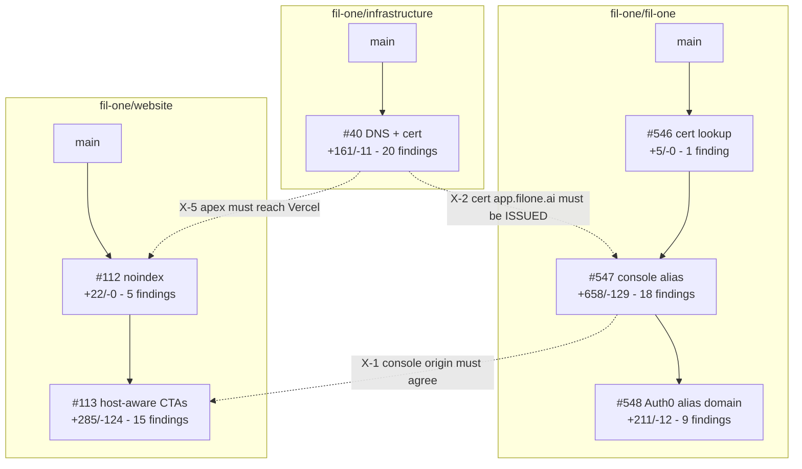

# PR stack review — FIL-897 — 2026-08-10

## 1. Summary

Six PRs across three repositories serve the marketing site and console from `filone.ai`
so demos survive `fil.one` being blocklisted. The approach is sound and the two real
bugs the stack exists to fix are correctly fixed: `getStageFromHostname` exact-matched a
single host (showing production users staging S3 endpoints on the alias), and
`resolveOrigin` ignored the viewer host (bouncing alias sign-ins onto the blocklisted
domain). Neither is a redesign candidate.

**The dominant problem is comment volume, and it is not evenly distributed.** In
`fil-one/infrastructure` 99 of 161 added lines are comments. In `fil-one/fil-one`,
`packages/shared/src/constants.ts` gained 15 effective lines of code against 68 lines of
JSDoc, and the same rationale — Enterprise-plan limitation, flagged TLD, host-scoped
cookies, passkey relying-party ID, the accepted mail-deliverability trade — is written
out in full in **five** places across two repos. Most of that prose was lifted from PR
descriptions, which is where it belonged.

The second problem is **four factual errors in comments and PR bodies**, three of which
would mislead a reader into a wrong action:

- `fil-one/infrastructure` asserts a Terraform change is "a no-op in the plan" when it
  cannot be one, in a repo that auto-applies on merge (**F-01**).
- `fil-one/website` documents the prerender mechanism as "a headless browser" — it is
  jsdom plus `renderToString` — and credits hydration for correcting hrefs, which React
  18 does not do for attributes. The real mechanism is a `React.lazy` boundary, and the
  approach breaks silently if anyone makes routes eager (**F-51**, **F-52**).
- PR #546's entire stated rationale contradicts comments in two other repos (**F-42**).
- `docs/Auth0OneTimeSetup.md`'s operational checklist omits two of the four edits needed
  to add an alias, both omissions producing a silently half-working alias (**F-45**).

**Two open blockers**, neither resolvable from the diff: whether Vercel applies all
matching `headers` rules or only the first (**F-50** — if first-match, `#112` is a no-op
and the alias gets indexed), and whether `aws.acm.getCertificate` matches SANs or only
the primary domain (**F-42** — decides whether `#546` is load-bearing at all).

The scope reversal — website+console → console-only → website+console — is confirmed in
the reflog of `srdjan/fil-897-console-alias` (four amends) and left three concrete
residues in the tip, all cleanable by deletion.

### Diff, current and estimated after cleanup

| Repo | Current | After cleanup | Read via |
|---|---|---|---|
| `fil-one/infrastructure` | +161 / −11, 2 files | ~+95 / −11 | local clone, full-tree grep |
| `fil-one/fil-one` | +874 / −141, 20 files | ~+700 / −150 | local worktree, full-tree grep |
| `fil-one/website` | +307 / −124, 54 files | ~+295 / −130 | local clone, full-tree grep |

Reduction is almost entirely comment deletion plus five deleted tests. No structural
change is proposed anywhere.

### Coverage and what this review could not establish

6/6 PRs diffed per-PR and cumulatively; every changed file in all three repos was read.
Three gaps, all recorded in the findings that depend on them:

- **FIL-897 itself was not read.** The Linear MCP server is unauthenticated in this
  session and cannot be authorised non-interactively. Every specification finding below
  is measured against internal inconsistency between code, comments and PR bodies — not
  against acceptance criteria. **An acceptance criterion that no code satisfies would not
  have been caught**, with the partial exception of F-69.
- **No test run.** The PR bodies' test counts (2227 / 2242) are unverified.
- **Two provider/platform behaviours could not be checked offline**: Vercel `headers`
  match semantics (F-50) and whether `cloudflare_record.name` is ForceNew in provider
  v4 (F-01's severity turns on it).

No prior review files, no `FIL-112-REMEDIATION.md`, and no `PR-STACK-ARCHITECTURE-*.md`
exist in any of the three repos, so §3 is empty and there is nothing to carry forward.

**No ADR is warranted.** Every finding is cleanup, a factual correction, or a decision
already recorded in the PR bodies; none establishes a constraint beyond this stack where
a reasonable engineer could choose differently.

## 2. Change set map

### `fil-one/infrastructure`

| Pos | PR | Title | Branch | Base | State | +/− | Files | Findings |
|---|---|---|---|---|---|---|---|---|
| 1 | [#40](https://github.com/fil-one/infrastructure/pull/40) | Serve the website and console from filone.ai as a demo alias | `srdjan/fil-897-filone-net-dns-cert` | `main` | draft | +161/−11 | 2 | 20 |

### `fil-one/fil-one`

| Pos | PR | Title | Branch | Base | State | +/− | Files | Findings |
|---|---|---|---|---|---|---|---|---|
| 1 | [#546](https://github.com/fil-one/fil-one/pull/546) | Tolerate multiple ISSUED certs in the ACM cert lookup | `srdjan/fil-897-cert-lookup-most-recent` | `main` | draft | +5/−0 | 1 | 1 |
| 2 | [#547](https://github.com/fil-one/fil-one/pull/547) | Serve the production console from a demo-alias hostname | `srdjan/fil-897-console-alias` | #546 | draft | +658/−129 | 13 | 18 |
| 3 | [#548](https://github.com/fil-one/fil-one/pull/548) | Authenticate demo-alias hosts against the Auth0 tenant domain | `srdjan/fil-897-auth0-alias-domain` | #547 | draft | +211/−12 | 10 | 9 |

Ref chain verified, not assumed: `546 → main`, `547 → 546`, `548 → 547`. Numeric order
matches. Each branch is a single commit.

### `fil-one/website`

| Pos | PR | Title | Branch | Base | State | +/− | Files | Findings |
|---|---|---|---|---|---|---|---|---|
| 1 | [#112](https://github.com/fil-one/website/pull/112) | Keep the filone.ai demo alias out of search results | `srdjan/fil-897-alias-noindex` | `main` | draft | +22/−0 | 2 | 5 |
| 2 | [#113](https://github.com/fil-one/website/pull/113) | Point console CTAs at the console on the current hostname | `srdjan/fil-897-host-aware-console-links` | #112 | draft | +285/−124 | 52 | 15 |

Ref chain verified via `git merge-base --is-ancestor`. **`origin/main` has moved 6
commits ahead of the merge-base** since the last rebase; none touch files in this stack.

*Caption: findings concentrate in `#547` and `#113`, the two PRs that carry the bulk of the diff; the dashed edges are the three cross-repo dependencies that make this one review rather than three.*

### Cross-repo dependencies

| ID | Edge | Basis | Citation |
|---|---|---|---|
| X-2 | `infrastructure#40` → `fil-one#547` | cited both sides | `filone-ai.tf` `domain_name = "app.filone.ai"` ↔ `sst.config.ts:222` `aliasHosts[0]` cert lookup |
| X-1 | `fil-one#547` → `website#113` | cited both sides | `constants.ts` `MARKETING_URL_BY_CONSOLE_ORIGIN` ↔ `console-url.ts` `CONSOLE_ORIGIN_BY_SITE_HOST` |
| X-5 | `infrastructure#40` → `website#112` | cited both sides | `filone-ai.tf` apex `A` → Vercel ↔ `vercel.json` `has.host` rule; until the apex reaches Vercel the rule matches nothing |
| X-3 | `fil-one#546` → `infrastructure#40` | **disputed — see F-42** | asserted by #546's body only; contradicted by comments in `#547` and `filone-ai.tf` |
| X-4 | `fil-one#551` (FIL-627) ↔ this stack | cited both sides | not part of this change set; three overlapping hunks, see §4 |

### Findings concentration

| Repo | PR | comment-slop | dead-weight/churn | naming | tests | duplication | correctness | specification | Total |
|---|---|---|---|---|---|---|---|---|---|
| infrastructure | #40 | 8 | 3 | 3 | 0 | 1 | 3 | 2 | 20 |
| fil-one | #546 | 0 | 0 | 0 | 0 | 0 | 0 | 1 | 1 |
| fil-one | #547 | 5 | 4 | 3 | 4 | 1 | 0 | 1 | 18 |
| fil-one | #548 | 3 | 0 | 0 | 3 | 1 | 1 | 1 | 9 |
| website | #112 | 1 | 0 | 0 | 0 | 0 | 1 | 3 | 5 |
| website | #113 | 4 | 2 | 1 | 4 | 3 | 0 | 1 | 15 |
| | | **21** | **9** | **7** | **11** | **6** | **5** | **9** | **68** |

## 3. Status of prior review findings

None. No prior review files exist in any of the three repositories, and no PR carries a
human review comment — the only comments are Linear linkbacks and one authored note on
`infrastructure#40` explaining the failing Terraform check. Nothing to carry forward,
nothing to reopen.

## 4. Cross-repo findings

**X-1 — `app.filone.ai` is declared independently in seven places across three repos.**
Both sides cited. `fil-one/fil-one` `packages/shared/src/constants.ts` declares it in
`PROD_CONSOLE_ALIAS_HOSTS`, `MARKETING_URL_BY_CONSOLE_ORIGIN` and
`AUTH0_DOMAIN_BY_CONSOLE_ORIGIN`; `fil-one/website` declares it in
`console-url.ts`'s `CONSOLE_ORIGIN_BY_SITE_HOST` and in `vercel.json`'s host regex;
`fil-one/infrastructure` declares the DNS records and the certificate name.

The duplication is **forced** — `@filone/shared` is an unpublished workspace package, so
`fil-one/website` cannot import it. The fix is therefore a cross-reference comment plus a
complete checklist (**F-45**, **F-67**), never shared code.

Drift is silent in both directions. Adding a second alias to `PROD_CONSOLE_ALIAS_HOSTS`
and the Terraform, but not to `CONSOLE_ORIGIN_BY_SITE_HOST`, sends that alias's marketing
CTAs to `app.fil.one` — the exact failure the stack exists to prevent, with no error, no
test failure and no log. Not adding it to `AUTH0_DOMAIN_BY_CONSOLE_ORIGIN` routes its
login through the flagged TLD (**F-37** adds the test that catches this). Not adding it to
`vercel.json` gets it indexed.

The round trip does close correctly today: `MARKETING_URL_BY_CONSOLE_ORIGIN` maps
`https://app.filone.ai` → `https://filone.ai`, the website's map has `filone.ai` as a key,
and `vercel.json`'s `(www\.)?filone\.ai` covers the apex. No drift now.

**Naming across the boundary.** `fil-one/fil-one` names by *host* (`PROD_CONSOLE_HOST` =
`'app.fil.one'`); `fil-one/website` names by *origin* (`DEFAULT_CONSOLE_ORIGIN` =
`'https://app.fil.one'`). Each is right locally and both use "console" consistently — do
not rename either. The genuine gap is that the alias *site* hosts (`filone.ai`,
`www.filone.ai`) have a name and rationale in `fil-one/fil-one`'s doc comment but are bare
keys with no term in `fil-one/website`. **F-67** closes it with one comment line.

**X-2 — cert-name coupling, correct today but documented on only one side.**
`sst.config.ts:222` looks the CloudFront viewer certificate up by `aliasHosts[0]`, i.e.
`PROD_CONSOLE_ALIAS_HOSTS[0]`. `environments/prod/filone-ai.tf` sets
`domain_name = "app.filone.ai"` and its comment explains exactly why the alias is the
primary domain. Nothing on the `constants.ts` side says that array order is load-bearing
— **F-29** adds it.

**X-3 — the `#546 → infrastructure#40` ordering constraint is disputed.** See **F-42**.
`#546`'s description says a `domain: 'app.fil.one'` lookup matches both the old cert and
the new one carrying that name as a SAN, and that `mostRecent: true` is what keeps the
intermediate state deployable. Comments added by `#547` **and** by `filone-ai.tf` both
assert the opposite — that the data source matches only a certificate's primary domain,
which is the entire justification for making the alias primary. Both cannot be true. **Do
not put `#546` before `#40` in the landing sequence until this is resolved**; if the
primary-domain reading is correct, the constraint does not exist.

**X-4 — `fil-one#551` (FIL-627) collides with this stack in three files.** Not part of
this change set and its content was not reviewed. Hunk-range comparison, both against
`main`:

| File | #551 hunks | FIL-897 hunks | Collision |
|---|---|---|---|
| `packages/shared/src/index.ts` | 15–20 | 17–22 | yes, overlapping export list |
| `packages/shared/src/constants.test.ts` | 6–11, 88–93 | 8–13, 109–129 | yes, overlapping import block |
| `sst.config.ts` | 239–255 | 239–246 and five others | yes — FIL-897 *deletes* the `await import('@filone/shared')` destructure at 239–246, hoisting it to 190; a resolution that restores it produces a duplicate `const` |
| `packages/shared/src/constants.ts` | 95–103, 111–119 | 126–141 | no, 6 lines of separation |

All three are mechanical, but the `sst.config.ts` one has a plausible wrong resolution
that only `pnpm build` catches. Whichever stack merges second eats the rebase.

**X-5 — `website#112` is inert until `infrastructure#40` applies.** `filone.ai` currently
redirects at the Cloudflare edge and never reaches Vercel, so the `has.host` rule matches
nothing. Merging `#112` first is behaviourally harmless but makes its README claim false
in the interim (**F-65**).

## 5. Per-repo findings

Full current → desired detail for every finding is in
`PR-STACK-IMPLEMENTATION-FIL-897-2026-08-10.md`, which is the executable form. This
section is the index and the reasoning.

### `fil-one/infrastructure` — #40

**Comment slop (8).** `F-06` the `192.0.2.1` history paragraph, duplicated verbatim in the
commit message. `F-07` four lines defending against a `create_before_destroy` that is not
present, while the one place it *is* present is unexplained. `F-08` the ACM
one-CNAME-per-domain rule written out twice across two files, sixteen lines for one fact —
and the two copies have already drifted, which is F-01. `F-09` header item 2 restating the
three resources below it. `F-10` a comment saying the Redirect Rule is gone, sixty lines
below one saying it must still be deleted by hand. `F-11` a promise about a future PR.
`F-12` two comments whose first sentence restates the code. `F-13` a banner divider, the
only one in the repo.

**Naming (3).** `F-15` four new resources abandon the file's `filone_ai_` prefix for
`app_alias`, which reads as "an alias record for app" rather than "the app record in the
alias zone" — and none of them names the zone, which is what a reader scanning two
near-identically-named zone files needs. All four are new and not in state, so renaming is
free. `F-16` `app_alias_validation` and `app_filone_validation` are named on two different
axes, so nothing in the pair says which is which; one is read from the *other file*.
`F-18` the branch is still `srdjan/fil-897-filone-net-dns-cert`.

**Dead weight (3).** `F-14` an unmarked to-do (`note here what it pointed at`) that nothing
will surface, pointing at a different destination than the PR body does, for a fact that
belongs in the README. `F-17` see correctness. `F-19` `validation_record_fqdns` reaches
across into the other zone file, making the two files mutually dependent; conditional on
F-01's plan result.

**Duplication (1).** `F-08`, above — comment duplication that must change together.

### `fil-one/fil-one` — #546, #547, #548

**Comment slop (8).** `F-20` 16 lines of JSDoc on a one-element array, three of four
paragraphs business narrative already written at greater length in
`docs/Auth0OneTimeSetup.md` §4a. `F-21` 20 lines on a two-entry table, both bullets
reproduced almost word for word in two other files. `F-22` 21 lines on a five-line
function, the third copy of the same rationale. `F-23` 33 lines on 11 lines of code, lifted
from the PR description — be surgical, the `x-forwarded-host` trust boundary and the
no-comma-splitting bullet must stay, the rest goes. `F-24` a six-line comment restating the
table's own JSDoc at its only call site. `F-25` a changelog note explaining why a file was
created. `F-26` restates `PRODUCTION_HOSTS.has(...)`, already pinned by five tests.

**Churn (3).** `F-27` `marketingUrlsFor` exists only because the re-add was written
differently from the original, breaking symmetry with the two `reduce`s beside it. `F-28` a
test *fixture* edit that changes nothing the test asserts. `F-20`'s comment grew rather
than shrank across the round trip. §4 of the implementation doc has the reflog evidence.

**Dead weight (2).** `F-29` `aliasHosts[0] ?? domainName` — the fallback is unreachable to
the type checker and the one runtime case that reaches it is the rollback #547 prescribes,
which is itself unsafe once the old cert is retired. `F-47` four normalisations in
`parseAliasSiteUrls` for a value whose sole producer can generate none of them.

**Naming (3).** `F-31` `const websiteUrl = resolveOrigin(event)` — the value is
specifically *not* `WEBSITE_URL` whenever the user is on an alias, which is the point of
the change; two sibling handlers already call it `origin`. `F-32` both tables write the
canonical key as a computed template literal and the alias key as a plain string, which
defeats grep and is the worst of both. `F-33` one concept, four names, two units.

**Tests (7).** `F-37` is the highest-value finding in the repo: `#548` added
`AUTH0_DOMAIN_BY_CONSOLE_ORIGIN` and touched no test in `packages/shared`, so the marketing
table has a completeness invariant and the Auth0 table has none — and the failure that
invariant would catch is routing a new alias's login through the flagged TLD, exactly the
bug `#548` exists to fix. `F-35` a hostile-input table copied as a strict subset of
another, testing one property seven times while omitting the two rows that would
discriminate between the functions. `F-38` three assertions that read a literal out of an
object literal and assert it equals that literal. `F-39` a duplicated test that passes for
the wrong reason, because the fixture sets `WEBSITE_URL` outside its own allowlist — a
state `sst.config.ts` cannot produce. `F-40` a test pinning tolerance for four input shapes
no caller can generate. `F-41` an assertion that depends on unreset module state
(low confidence; prefer the comment fix).

**Duplication — two deliberate no-change verdicts.** `F-34` `resolveOrigin` and
`resolveAuth0Domain` look near-identical but differ in fallback, gate, and the
`x-dev-origin` branch that must **not** exist in the Auth0 path. Do not extract. `F-36` the
three lookup tables read like one table with three columns, but collapsing them changes two
exported types and touches six consumers across three packages — that is a redesign, out of
scope. Both are filed explicitly so a later session does not "fix" them.

### `fil-one/website` — #112, #113

**Comment slop (5).** `F-51`, `F-52` see correctness. `F-53` a paragraph defending a
call-site idiom used in 3 of 50 files. `F-54` "verified rather than assumed" is changelog;
the imperative that follows it is the one thing that stops someone folding this into an env
var, and must stay. `F-66` a Linear key in a README heading and an "Until FIL-897, …"
sentence describing a state that will not exist once the stack lands.

**Dead weight (2).** `F-55` `consoleOrigin()` is exported with no production caller, and
`consoleUrl()` called with no argument returns exactly the same thing — two spellings of one
concept, the better-named one unused. `F-56` `DEFAULT_CONSOLE_ORIGIN` is exported for tests
only.

**Tests (4).** `F-57` the fallback origin is asserted two different ways in one file, and
the imported form is a tautology that cannot catch the mistake worth catching. `F-60`
`CtaSection.test.tsx` still asserts the literal the component no longer contains — it passes
only because jsdom's hostname is `localhost`. `F-61` needless single-element tuples. `F-62`
the `location` stub spreads the real `Location`, producing a stub whose `hostname` and
`host` disagree.

**Naming (1).** `F-64` the README names `consoleUrl()` as the helper to use; 123 of 125
calls are `signupUrl()`, so a contributor following it hand-writes the magic query string
the module exists to hide.

**Duplication (3).** `F-58` two idioms for the same call, and the module-scope one is the
sole reason `console-url.ts` needs F-53's paragraph. `F-59` the only new file in the repo
written in single quotes against 876 double-quoted imports — bleed-through from the sibling
monorepo, invisible to lint because no `quotes` rule is set. `F-67` see X-1.

**One deliberate no-change verdict.** `F-68` `signupUrl()` earns its place: 125 call sites,
and it hides an Auth0-specific `screen_hint=signup` parameter no marketing page should know.
Inlining it would restore the copy-paste hazard `#113` removed. Filed so nobody re-derives it.

## 6. Correctness findings

**F-01 — `fil-one/infrastructure` — `app_acm_validation` cannot plan as a no-op, and the
comment says it does. Blocker until the plan is read.**
`environments/prod/fil-one.tf`, comment above `cloudflare_record.app_acm_validation`:
`certificates, so the values are identical and this is a no-op in the plan — but`.
The record exists in state with concrete values. The PR repoints all three attributes at
`local.app_filone_validation`, derived from a certificate that does not exist yet, so at
plan time they are **unknown** — Terraform must plan a change regardless of what the values
become. If `name` is not ForceNew in `cloudflare/cloudflare ~> 4.0` this is an in-place
rewrite with identical values; if it is, the validation record protecting the certificate
CloudFront is **currently serving** is destroyed and recreated during an unconfirmed
production apply. I could not check ForceNew offline. **The speculative plan already posted
on #40 answers it for free — read it before merging.** Confidence: high on the mechanism,
medium on severity.

**F-17 — `fil-one/infrastructure` — `create_before_destroy` does not solve the problem the
comment beside it describes.** `environments/prod/filone-ai.tf`,
`aws_acm_certificate.app_alias`. The comment explains at length that mutating the old cert
fails because `DeleteCertificate` raises `ResourceInUseException` while CloudFront
references it. CBD does not avoid that: it reorders create-before-destroy, but the destroy
still runs in the same apply, and CloudFront's reference is set by `sst.config.ts` outside
this state, so nothing in this apply moves it. No resource in this state consumes the cert
ARN except its own validation. It is the standard ACM idiom carried in from configurations
where the consumer *is* in the same state, and it is the file's only `lifecycle` block,
unexplained, in a file that spends four lines explaining why CBD must *not* be used
elsewhere. Delete, or document what it actually buys. Confidence: high on the mechanism.

**F-50 — `fil-one/website` — the `noindex` rule is placed last, behind two catch-alls, and
Vercel's match semantics are unverified. Blocker until a preview is checked.**
`vercel.json`, `headers[4]`. Indices 2 and 3 between them match every path on the site. If
`headers` are first-match-wins, the rule never fires, `#112` is a no-op that reads as done,
and the alias is indexed as duplicate content. I believe `headers` are cumulative — unlike
`redirects`/`rewrites` — but that belief is not evidence and cannot be tested locally. The
discriminating check is whether `Cache-Control` **and** `X-Robots-Tag` both appear on one
response; the four `curl` assertions are in the implementation doc as a merge gate on
`#112`. Confidence: the risk is real and unresolved; the guess that it is benign is low.

*On the regex itself there is no finding.* Unanchored `(www\.)?filone\.ai` cannot match
`fil.one` or `www.fil.one` (there is a dot where `filone` needs none) or a Vercel preview
host, and every host it over-matches is one you want noindexed. JSON double-escaping is
correct.

**F-51 / F-52 — `fil-one/website` — the `console-url.ts` doc comment describes the wrong
mechanism twice, and the second error hides a real fragility.**
`src/lib/console-url.ts`, module doc comment.
(a) "pre-rendered … in a headless browser" is wrong: `scripts/prerender.mjs` says of itself
that it *replaced* Puppeteer with `renderToString`, and the `localhost` value comes from
`new JSDOM(…, { url: "http://localhost/" })`. The same false claim is in `#113`'s
description.
(b) "React corrects the hrefs as it hydrates" is wrong: React 18 `hydrateRoot` warns on
mismatched **attributes** and leaves the server value in the DOM. If hydration were the
mechanism, `#113` would not work. It works because every route in `src/App.tsx` is a
`React.lazy` chunk — hydration suspends at that boundary and the page is client-rendered
fresh. **That is a load-bearing dependency documented nowhere**: making routes eager to save
a request would silently break every CTA on the alias, with no test failure. The Playwright
result in `#113`'s body is real, but it was consistent with either explanation, so it did
not distinguish them. Confidence: high on the lazy boundary (cited in `App.tsx`);
medium-high on React 18's attribute behaviour, reasoned from documented behaviour, not
executed.

**F-46 — `fil-one/fil-one` — `AUTH0_DOMAIN_BY_CONSOLE_ORIGIN` is production-scoped but
consumed on every stage, and the comment asserts a safety property that is false off
production.** `packages/backend/src/lib/auth0-domain.ts`. Both table keys are production
hosts and both values are production Auth0 domains, but `resolveAuth0Domain` is deployed to
every stage and read in five places. On staging, a request to the public execute-api URL
carrying `x-forwarded-host: app.fil.one` returns `auth.fil.one` — the production tenant —
inside a Lambda holding dev-tenant credentials. **This is not an authentication bypass**:
`AUTH0_AUDIENCE` differs by stage and `iss` mismatches in both directions, so all three call
paths fail rather than succeed. It is a header-forgeable denial of the login path on
non-production stages. What is plainly wrong is the comment: it says the two mapped domains
"belong to the same tenant and share signing keys", which is false on every stage except
production, where most deployments run. Recommend the comment-only fix plus a
production-scoped note on the table; gating the lookup on stage is a behaviour change and
not worth it for this residual. Confidence: medium.

## 7. Attributed to specification

**F-02b — the PR body claims a file deletion that is not in the PR.**
`infrastructure#40`: "`filone-net.tf` is deleted". That file is not in the changed set, is
not tracked, and `git log --all --diff-filter=A` finds no surviving commit that ever added
it — it existed only in an amended-away commit. Leftover from the `filone.net` iteration.
Delete the clause. **Decision: none, just fix the description.**

**F-02 — the PR body's expected plan undercounts, mis-calibrating its own blocker
criterion.** `infrastructure#40` says "expect 2 records changed"; three change (F-01). The
same paragraph declares any `fil.one`-zone diff a blocker, so an author following the
checklist cannot distinguish the expected `app_acm_validation` diff from a broken mail
record. **Decision: none, fix the count.**

**F-42 — `#546`'s entire stated rationale contradicts comments in two other repos.** See
X-3. `node_modules/@pulumi/aws/acm/getCertificate.d.ts` documents `domain` as "Domain of
the certificate to look up", which reads as primary-domain matching, so the primary-domain
reading is probably right and `#546`'s stated reason is probably false. `mostRecent: true`
is still worth keeping for a *different* reason that does not depend on SAN matching:
`aws_acm_certificate.app_alias` is `create_before_destroy`, so any future SAN change
transiently leaves two ISSUED certs with the same primary domain. **Decision the author must
make: resolve which claim is true. If the primary-domain reading holds, `#546` is not
load-bearing and the sequencing constraint it imposes on `infrastructure#40` disappears.**

**F-43 — three places and a PR body say the Auth0 domain is keyed on the "resolved origin";
the code keys on the raw `x-forwarded-host` header.** The difference is real —
`resolveOrigin` also honours `x-dev-origin` and requires membership of
`ALLOWED_REDIRECT_ORIGINS`. **Keying on the header is the correct design** (a dev origin must
never select an Auth0 domain), so the code is right and the descriptions are wrong. Change
"the resolved origin" to "the request host" in all three. **Decision: none, fix the prose.**

**F-44 — `#548`'s body claims its test "covers the same hostile-input set as
`resolve-origin`".** It covers 7 of 13 rows, and the two omissions that matter are the ones
F-35 identifies. **Decision: none, correct the claim.**

**F-45 — `docs/Auth0OneTimeSetup.md` §4a is the operational checklist for the whole feature
and omits two of the four required edits.** It names `PROD_CONSOLE_ALIAS_HOSTS` and
`AUTH0_DOMAIN_BY_CONSOLE_ORIGIN` but not `MARKETING_URL_BY_CONSOLE_ORIGIN` (without which
logout from the new alias silently returns to the domain the alias exists to avoid) and not
`CONSOLE_ORIGIN_BY_SITE_HOST` in `fil-one/website` (without which its marketing CTAs point
at `app.fil.one`). Both omissions produce a silently half-working alias — the failure mode
the whole stack was built to prevent. **Decision: none, complete the checklist.**

**F-63 — `#112`'s README references `src/lib/console-url.ts`, which does not exist on
`#112`'s branch.** `#112` is deliberately structured to be mergeable alone, and if it is, the
README instructs contributors to use a file that is not in the tree. This is the one place
the two-PR split leaks. **Decision: move the bullet to `#113`.**

**F-65 — `#112`'s README asserts the alias console already answers.** Both clauses are
conditional on work outside the repo that has not merged. If `#112` lands first — the stated
plan — the README is wrong on merge. **Decision: write the dependency rather than the
outcome, or land `#112` after its prerequisites.**

**F-69 — 29 links still send alias visitors to the blocklisted domain.** 25 ×
`https://docs.fil.one`, 4 × `https://status.fil.one` across `src/**`. `#113`'s own framing is
that a hardcoded console link "breaks the demo at the first click"; the same is true of the
docs link. **This is not a code defect** — `docs.filone.ai` and `status.filone.ai` do not
exist and `filone-ai.tf` does not provision them, so there is nothing to point at. The gap
is in the acceptance criteria, which scoped the fix to console CTAs. **Decision the author
must make: provision `docs.` and `status.` on the alias (an infrastructure change beyond this
stack), or accept that clicking docs mid-demo fails and record it in the README next to
"Keep the alias unadvertised".** Note this is also the closest thing to a spec-level gap this
review could find without access to FIL-897.

## 8. Questions for the author

1. **F-42, blocking.** Does `aws.acm.getCertificate({ domain })` match SANs or only the
   primary domain? Decides whether `#546` is load-bearing and whether its sequencing
   constraint is real.
2. **F-01, blocking.** Read the speculative plan on `#40`. Is `app_acm_validation` an
   in-place update or a replacement?
3. **F-50, blocking.** Run the four `curl` assertions against a Vercel preview. Are
   `headers` cumulative?
4. **F-52.** Was the `React.lazy` route boundary a known part of the design, or luck? If
   luck, F-52's comment is the whole value of the finding.
5. **F-29.** What is the real rollback for the alias once the old `app.fil.one`-only cert is
   retired? Emptying `PROD_CONSOLE_ALIAS_HOSTS`, which `#547` prescribes, makes `certDomain`
   fall back to a name no cert will have a primary claim on.
6. **F-46.** Comment-only fix, or gate the table on production? Recommend comment-only.
7. **F-17.** Delete `create_before_destroy`, or keep it and document what it buys?
8. **F-58.** Delete the three `SIGNUP_URL` module constants (which also deletes F-53's
   paragraph), or keep the smaller diff?
9. **F-15 / F-16.** Do you want the Terraform renames? They are free now — the resources are
   not in state — and never will be again.
10. **Do you accept the pre-hydration click window?** Because route chunks load
    asynchronously, there is a window on first load where the DOM holds the prerendered
    `app.fil.one` href. Milliseconds on a warm connection, but it is the residual the
    edge-redirect fallback would have closed.
11. **F-36 / X-1.** Reopen the three-tables-vs-one question, or a real contract between
    `fil-one/fil-one` and `fil-one/website`, as separate tickets? Both are redesigns and out
    of scope here.

## 9. Out of scope

Pre-existing, noticed and deliberately excluded. None is a task.

**`fil-one/infrastructure`.** `filone` meaning `fil.one` while `filone_ai` means
`filone.ai` — a one-token distinction between the zone serving the console and the zone
delivering every production password reset; F-16 works around it rather than fixing it, since
both `data.cloudflare_zone` names are in state. `cloudflare_record.paul_wagner_testing` /
`monkeyquest`, a personal test record in production DNS. `Vercel_main_page` and `status_page`
— PascalCase and snake_case in one pair, neither name saying "verification". `environments/staging/fil-one.tf`
still uses the index-based `tolist(...)[0]` pattern this PR replaces in prod, so the two
environments have diverged further. `.gitignore` excludes `.terraform.lock.hcl`, so provider
versions resolve fresh on every run under `~> 4.0` — relevant background for F-01.

**`fil-one/fil-one`.** `AUTH0_AUDIENCE`'s literal was deliberately *not* replaced with
`PROD_CONSOLE_HOST` — an Auth0 API identifier is a wire value that happens to look like a
URL, and coupling it to a hostname constant invites a rename that invalidates every issued
token. Recorded so a later "finish applying the constant" pass does not touch it.
`allowedRedirectOrigins = allowedOrigins.join(',')` conflates CORS origins with the redirect
allowlist; predates this stack. `getS3Endpoint`'s commented-out line and its `//TODO` —
`#551` is actively changing that function.

**`fil-one/website`.** `package.json` still carries the `reactSnap` block and the
`react-snap` devDependency, both dead since `scripts/prerender.mjs` replaced them;
`useSeo.ts` and `main.tsx` still mention react-snap. Same stale terminology as F-51, but F-51
is in scope only because `#113` *added* a new instance of it. `eslint.config.js` sets no
`quotes` rule and disables `no-unused-vars` — which is why F-59 passed lint and why an
orphaned import in the 50-file edit would not have been caught (I checked manually; there are
none). 8 pre-existing warnings in `src/components/ui/*`. The 24
`https://eu-west-1.s3.fil.one` endpoint strings in code samples, same category as
`RagPipelineProductPage`.

**Declared by the stack and not re-raised as findings.** Presigned URLs on
`<region>.s3.fil.one` until FIL-627; the `us-east-1` S3 gateway rejecting the alias origin;
no `X-Robots-Tag` on the console; the accepted mail-reputation coupling between the alias and
`no-reply@filone.ai`. All four are recorded in the PR bodies as known and accepted.
