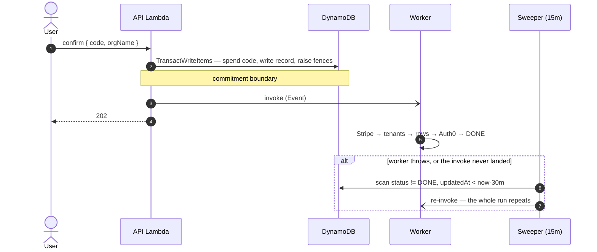

# ADR: Self-serve account deletion

**Status:** Proposed
**Date:** 2026-08-13

## Context

Self-service account deletion feature is unavailable today. Building it means removing state across multiple separate systems with unrelated failure modes: DynamoDB (`UserInfoTable`, `BillingTable`, `RagIndexerTable`), Stripe, regional storage orchestrators, Auth0, and the S3 Vector indexes.

It's not possible to do an atomic cleanup across all these systems. Partially finished teardowns are therefore normal rather than exceptional. The design has to decide two things: where the point of no return sits, and what happens after each partial failure.

## Decisions

### 1. Deletion starts at the confirmation

After the user submits the deletion confirmation code a transactional write to the DynamoDB is invoked writing the `DELETION` record (tombstone), and raises the write fences. The `202` status code is returned after the transaction is committed. From that moment on the account is unusable: all sessions are killed and new resource creation is refused.

These writes share a transaction because a spent code must never exist without a `DELETION` record behind it. Codes are rate limited, so a user left in that state cannot simply retry.

After the transaction is committed deletion worker is invoked. In the case of invocation failing the deletion will be picked up within up to 30 minutes by the cron worker and a new invocation will be issued. Confirm does not fail the request when the invocation fails, since the record is the source of truth rather than the invocation.

### 2. Teardown is idempotent; error recovery means re-running the teardown job

Given that every step of the teardown is idempotent, recovery simply means re-running the whole teardown. With idempotency being a property of the teardown / deletion worker we were able to avoid usage of state machines and need for checkpointing.

This works because no teardown step is asynchronous on the vendor side. Every external call either finishes inside the call or fails. A step that reports its progress asynchronously would break the model and should reopen this ADR rather than add progress tracking to the record.

Two requirements follow from re-running, and both are easy to lose in a refactor:

- The worker's first read of the `DELETION` record is strongly consistent. An eventually consistent read immediately after the confirm transaction can miss the record and burn a retry.
- The worker updates `updatedAt` at the start of every pass, otherwise the cron re-drives a teardown that is progressing normally.

### 3. Multiple deletion guards

Due to our system having multiple write paths multiple deletion guards / fences had to be installed. These guards prevent new resource creation, resurection of the deleted records and request authentication.

| Guard                                    | Written at                                       | Stops                                                                           |
| ---------------------------------------- | ------------------------------------------------ | ------------------------------------------------------------------------------- |
| `ORG#/PROFILE.deleting = true`           | confirm, re-applied each pass                    | resource creation: access keys, RAG keys, buckets, tenant setup, RAG enablement |
| `SUB#/IDENTITY.deleted = true`           | confirm                                          | every existing session, on its next request                                     |
| `attribute_exists(pk)` on billing writes | already on every `CUSTOMER#/SUBSCRIPTION` update | webhook resurrection of a purged billing row                                    |

None of the three covers the other two. `deleting` cannot guard a write that creates its own row, as there is no row yet to carry the condition. The identity flag stops the user but not third-party callbacks made on their behalf. `attribute_exists(pk)` covers the billing rows both of the others miss.

**NOTE:** tenant setup conditions on `attribute_not_exists(deleting)`. Setting `deleting: false` to unblock an org releases the other checks while leaving tenant setup refused permanently. The attribute has to be removed instead.

### 4. Confirmation is terminal

There are no soft-deletion windows, no restore paths, etc. The safeguard sits ahead of the confirmation instead: a code emailed to the requesting admin, plus typing the org name.

A grace period would make the guards in decision 3 provisional and force every reader of `deleting` to tell a reversible state from a final one.

### 5. Verification code gets its own table

Decision has been made to create a new `DeletionChallengeTable` rather that saving deletion challenge codes in `UserInfoTable` or `BillingTable`.

There are two reasons for this:

- `UserInfoTable` has no TTL configured. Enabling it there would make any accidental write of `ttl` attribute on an identity row a silent hard delete of account data.
- `BillingTable` has TTL and already holds `ORG#` partitions. But a short-lived security credential there widens what the billing writers' IAM policy covers and widens the scope of the table.

The code is stored as a keyed HMAC over `orgId:userId:salt:code`, rather than a plain digest, since a six digit code is cheap to enumerate offline from a table dump. Verification happens inside a `ConditionExpression`, so the digest never reaches our process. The plaintext is never persisted.

### 6. Delete the Stripe customer rather than redacting it

At the time of writing this ADR Stripe redaction API is in public preview and therefore not part of any stable version SDK.

To avoid using preview APIs we have opted for a simpler solution of deleting the stripe customer records.

Stripe customer cleanup has the following steps:

- Default payment method is collected
- Subscription is canceled
- Single attempt is made to collect any outstanding payments using the default payment method
- Customer is deleted

Cancellation is a separate step because `customers.del` cancels subscriptions silently and issues no invoice. The explicit cancel is what makes the outstanding usage billable at all.

A single best effort attempt it made to collect the user payment. A declined card must not block the teardown, and it does not need to: an outstanding invoice does not block customer deletion and stays open for finance afterwards.

Deleting the customer deletes all of their payment information. Invoices and charges are unaffected and keep referencing the customer id, so finance keeps the linkage either way.

**NOTE:** There is a possibility for us to not be able to bill the deleted customer in case the deletion happends before the first usage reporting.

### 7. Teardown order

Steps run strictly sequentially as there is no hard constraint on the teardown duration. Teardown happends in the following order:

- Stripe records — It's worth noting that we will bill the customer once the guards are up
- Tenant deletion
- Purging org records: RAG keys, RAG state, billing records, ORG profile, ORG member profiles — these rows hold the only pointers to the tenants and the Stripe customer, so they go after everything they point at
- Deleting Auth0 user — `sub` is the audit correlation key, and until it goes the user can still log in to see the deletion status. The identity guard already killed their sessions.

### 8. Remaining records

After the teardown most of the org records are deleted, with the remaining records being stripped of user data. What remains is:

- `SUB#/IDENTITY` is stripped to `deleted` and `deletedAt`, and kept. This prevents further re-signups after the account deletion.
- `EMAIL_NORM#/TRIAL_ENTITLEMENT` keeps the row and loses `userId`. This prevents trial reclamation
- `ORG#/DELETION` Tombstone record holding a snapshot of org, tenant, member and customer ids. The worker re-reads this snapshot on every pass, so it is also what makes re-running possible after the rows it points at are gone.

`EMAIL_NORM#` is the exception: its key is the plaintext address, which no attribute stripping fixes. The decision is to rekey it to a keyed HMAC, since an unkeyed digest of an enumerable address space is reversible by dictionary.

This should ship as **its own PR with a migration**, not inside the deletion work. It repoints the primary key of a live anti-abuse record whose writer claims it with `attribute_not_exists(pk)`, so a partial migration either grants a second free trial or locks a legitimate user out of their first. Deletion does not depend on it — the `REMOVE userId` works against either key format.

## Consequences

### Accepted costs

| Cost                                                            | Reasoning                                                                                                                                                                                                                                                                         |
| --------------------------------------------------------------- | --------------------------------------------------------------------------------------------------------------------------------------------------------------------------------------------------------------------------------------------------------------------------------- |
| Up to ~30 minutes before teardown starts, if the invoke is lost | Deletion need not be immediate. The fences already made the account inert.                                                                                                                                                                                                        |
| The sweeper runs a full-table `Scan`                            | Fine at current table size. Revisit when RCUs or scan duration show up in cost or latency; the fix is a sparse GSI on an attribute present only while `PENDING`.                                                                                                                  |
| The confirm transaction caps at 97 members                      | An org has one member today, since `createNewUserAndOrg` is the only `MEMBER#` writer. Past 97, overflow `SUB#` fences move ahead of the transaction as unconditional writes — arming a session kill early is safe. The code-spend, record and profile items must stay inside it. |
| Possibly up to 12 hours of unbilled storage per deleted org     | Only if the usage-reporting path proves too entangled to call directly. Bounded, and better than blocking the feature on that refactor.                                                                                                                                           |
| Finalized invoices keep their `customer_email` snapshot         | They are immutable, and retained on the same legal-obligation basis as the rest of the financial record.                                                                                                                                                                          |

### Deferred risk

A tenant-setup request that read the profile before `deleting` landed can create an upstream tenant, then be refused when it records the id. The result is a tenant with no local pointer. The window is bounded by API Gateway's 29-second timeout.

The fix is periodic reconciliation against provider tenant lists, filed as its own ticket. Growing the worker to cover it would trade a bounded leak for permanent complexity in the teardown path.

## Open questions

None blocks the architecture. Two need a decision owner outside engineering.

| Item                                                              | What is needed                                                                                                                                                                                                                                                                                                                                                                                                          |
| ----------------------------------------------------------------- | ----------------------------------------------------------------------------------------------------------------------------------------------------------------------------------------------------------------------------------------------------------------------------------------------------------------------------------------------------------------------------------------------------------------------- |
| HubSpot retains the contact, with email and marketing preferences | A product and legal call: delete the contact as a worker step, or document the retention as a lawful basis. As a step it inherits the same idempotency contract, where 404 counts as success.                                                                                                                                                                                                                           |
| Stripe customers created after the snapshot                       | The worker tears down the snapshotted `stripeCustomerId` only. A duplicate created later — the case `lib/create-billing-trial.ts` notes around the 24-hour idempotency-key expiry — would survive intact, including a chargeable card. Someone needs to establish whether this happens in practice. If it does, discover customers by `metadata.orgId` at the top of the Stripe step and run the sequence against each. |
